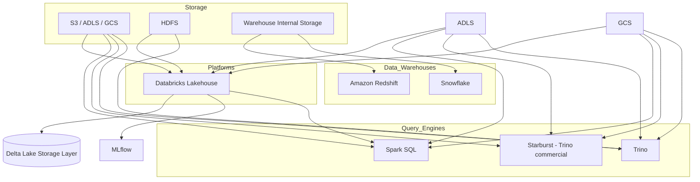

# data_warehouse

Snowflake, Redshift = warehouses (storage + compute tightly integrated).

Trino/Starburst = query engines.

Spark SQL = SQL interface on Spark (engine).

Databricks = Lakehouse platform (not just an engine, not just a warehouse).

