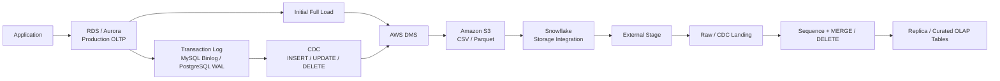

# OLTP to OLAP: AWS RDS / Aurora → DMS → S3 → Snowflake

## Overview

This architecture replicates data from a **production transactional database (OLTP)** into **Snowflake for analytical workloads (OLAP)**.

```text
Application
    ↓
RDS / Aurora
    ↓
AWS DMS
   ↙   ↘
Full    CDC
Load   Changes
   ↘   ↙
     S3
      ↓
Snowflake External Stage
      ↓
Raw / CDC Landing Tables
      ↓
MERGE / Transform
      ↓
Curated OLAP Tables
```

The main responsibilities are:

| Layer | Purpose |
|---|---|
| **RDS / Aurora** | Production relational database serving the application |
| **AWS DMS** | Initial replication + ongoing change capture |
| **Amazon S3** | Durable landing zone for replicated files |
| **Snowflake** | Reconstructs and serves the data for analytics |

---

# 1. Amazon RDS / Aurora — OLTP Source

## Amazon RDS

`RDS` = **Relational Database Service**.

RDS is AWS's managed service for running relational databases. AWS manages much of the underlying infrastructure such as provisioning, backups, patching, monitoring, and high availability.

Common database engines available through RDS include:

- MySQL
- PostgreSQL
- MariaDB
- Microsoft SQL Server
- Oracle
- IBM Db2
- Amazon Aurora

These can be the **actual production databases** used by applications.

Typical activity:

```text
customer creates order
        ↓
INSERT INTO orders ...

payment status changes
        ↓
UPDATE payments ...

record removed
        ↓
DELETE FROM ...
```

These workloads are **OLTP — Online Transaction Processing**:

- frequent inserts and updates
- point lookups
- relatively small transactions
- application-facing
- optimized for transactional consistency and low-latency reads/writes

---

## Amazon Aurora

**Amazon Aurora** is an AWS-managed relational database engine in the RDS ecosystem.

Aurora is compatible with:

```text
Aurora MySQL
Aurora PostgreSQL
```

Conceptually:

```text
Amazon RDS
├── MySQL
├── PostgreSQL
├── MariaDB
├── SQL Server
├── Oracle
├── Db2
└── Amazon Aurora
    ├── MySQL-compatible
    └── PostgreSQL-compatible
```

In this architecture, RDS/Aurora is generally the **system of record**.

Large analytical queries are usually moved away from the production database so OLAP workloads do not compete with the application.

---

# 2. AWS Database Migration Service (DMS)

`DMS` = **Database Migration Service**.

AWS DMS replicates data from the production database into another destination without requiring the application itself to write to the analytical platform.

For this pattern, DMS normally performs two jobs:

```text
1. Initial Full Load
2. Ongoing Change Data Capture (CDC)
```

---

## Initial Full Load

The **full load** copies the existing rows from the selected source tables.

Example:

```text
production.orders
10,000,000 existing rows
        ↓
       DMS
        ↓
S3 full-load files
```

This creates the initial snapshot of the source data.

After the initial copy, ongoing replication can switch to the database's transaction logs instead of repeatedly scanning the entire table.

---

# 3. CDC — Change Data Capture

`CDC` = **Change Data Capture**.

CDC captures changes that happen after the initial load.

Typical operations are:

```text
I = INSERT
U = UPDATE
D = DELETE
```

For example:

```text
INSERT customer 123
UPDATE order 456
DELETE payment 789
```

DMS converts those source-side changes into a stream of events that can be replicated downstream.

---

## Where does DMS get the changes?

DMS reads the database's **transaction/change logs**.

It does not need to repeatedly run:

```sql
SELECT *
FROM huge_table;
```

to determine what changed.

The exact mechanism depends on the source engine.

---

## MySQL / Aurora MySQL

For MySQL-compatible sources, DMS reads the **binary log**, usually called the **binlog**.

```text
Application
    ↓
INSERT / UPDATE / DELETE
    ↓
MySQL / Aurora MySQL
    ↓
Row-based Binary Log
    ↓
AWS DMS
```

For CDC, the MySQL-compatible source is configured to use **row-based binary logging**.

The binlog records changes made to database rows in sequence, allowing DMS to consume new activity without rereading the complete source table.

---

## PostgreSQL / Aurora PostgreSQL

PostgreSQL uses the **Write-Ahead Log (WAL)**.

```text
Application
    ↓
INSERT / UPDATE / DELETE
    ↓
PostgreSQL / Aurora PostgreSQL
    ↓
WAL
    ↓
Logical Replication
    ↓
AWS DMS
```

DMS uses PostgreSQL logical replication / logical decoding to consume changes from the WAL.

Primary keys are particularly important for CDC because updates and deletes need a reliable way to identify the affected source row.

---

## Full load vs. CDC

```text
FULL LOAD
---------
existing source table
        ↓
copy all selected rows
        ↓
baseline in target


CDC
---
new transaction
        ↓
binlog / WAL
        ↓
capture only the change
        ↓
apply downstream
```

This is what makes continuous replication practical even when the source table is very large.

---

# 4. Amazon S3 — Landing Zone

`S3` = **Simple Storage Service**.

DMS can write the replicated data into S3 rather than directly into Snowflake.

```text
RDS / Aurora
      ↓
     DMS
      ↓
     S3
      ↓
 Snowflake
```

S3 becomes a **durable landing layer** between the production database and the warehouse.

Benefits:

- extraction is decoupled from Snowflake ingestion
- files can be retained for replay or troubleshooting
- Snowflake does not connect directly to the production database
- source replication can continue even if downstream processing is delayed
- multiple downstream consumers can use the same landed data

---

## File formats

DMS can write S3 output in formats such as:

```text
CSV
Parquet
```

Parquet is commonly useful for analytical pipelines because it is:

- columnar
- compressed
- efficient to scan
- well supported by Snowflake

A generic folder layout might look like:

```text
s3://<bucket>/<database>/<schema>/<table>/
```

or separate full-load and CDC areas:

```text
s3://<bucket>/full-load/<schema>/<table>/
s3://<bucket>/cdc/<schema>/<table>/
```

The exact folder structure is implementation-specific.

---

## CDC records in S3

By default, DMS CDC output to CSV or Parquet can include a first field indicating the source operation:

```text
I = INSERT
U = UPDATE
D = DELETE
```

Conceptually:

```text
I | 1001 | customer_a | ...
U | 1002 | customer_b | ...
D | 1003 | customer_c | ...
```

That operation is later used in Snowflake to reconstruct the current state of the source table.

Full-load files are different: they represent the initial snapshot. Whether they contain an operation indicator depends on the DMS S3 target configuration.

---

# 5. Snowflake — OLAP Destination

Snowflake is the analytical / OLAP side of the architecture.

Typical Snowflake workloads include:

- large scans
- aggregations
- reporting
- BI dashboards
- historical analysis
- dbt models
- financial and analytical transformations

The ingestion path generally looks like:

```text
S3
 ↓
Storage Integration
 ↓
External Stage
 ↓
COPY INTO
 ↓
Raw / CDC Tables
 ↓
MERGE
 ↓
Replica / Curated Tables
```

---

# 6. Getting S3 Data into Snowflake

Assume the source data already exists in S3 and nothing has been configured in Snowflake yet.

There are two types of setup:

```text
ONE-TIME INFRASTRUCTURE
    storage integration
    file format

PER SOURCE / TABLE
    external stage
    target table
    CDC staging table
    load / merge logic
```

---

# 7. Create the Snowflake Storage Integration

A **storage integration** lets Snowflake assume an AWS IAM role instead of storing AWS access keys.

This is typically created by `ACCOUNTADMIN` or another role with the required integration privileges.

```sql
CREATE STORAGE INTEGRATION s3_data_int
    TYPE = EXTERNAL_STAGE
    STORAGE_PROVIDER = 'S3'
    ENABLED = TRUE
    STORAGE_AWS_ROLE_ARN = 'arn:aws:iam::<account-id>:role/<snowflake-reader-role>'
    STORAGE_ALLOWED_LOCATIONS = (
        's3://<bucket>/<prefix>/'
    );
```

The integration defines:

```text
Snowflake
    ↓ assumes
AWS IAM Role
    ↓ grants access to
S3 bucket / prefix
```

---

## Complete the AWS trust relationship

After creating the integration:

```sql
DESC INTEGRATION s3_data_int;
```

Snowflake returns values including:

```text
STORAGE_AWS_IAM_USER_ARN
STORAGE_AWS_EXTERNAL_ID
```

Those values are added to the AWS IAM role's trust policy.

After that:

```text
Snowflake-generated AWS identity
            +
Snowflake external ID
            ↓
AWS IAM role trusts Snowflake
            ↓
Snowflake can access the allowed S3 paths
```

One storage integration can be reused by multiple external stages as long as their locations fall within the allowed paths.

---

# 8. Create a File Format

For Parquet:

```sql
CREATE OR REPLACE FILE FORMAT ff_parquet
    TYPE = PARQUET;
```

For CSV, the format would contain properties such as the field delimiter, header behavior, quoting, and null handling.

The examples below assume **Parquet**.

---

# 9. Create an External Stage

A Snowflake **external stage** is essentially a named pointer to an S3 location.

For example:

```sql
CREATE OR REPLACE STAGE raw.stg_orders
    STORAGE_INTEGRATION = s3_data_int
    URL = 's3://<bucket>/<prefix>/orders/'
    FILE_FORMAT = ff_parquet;
```

At this point:

> **Nothing has been loaded into Snowflake yet.**

The stage only tells Snowflake where the files are and how to read them.

---

## Verify the stage

List available files:

```sql
LIST @raw.stg_orders;
```

Query the staged Parquet directly:

```sql
SELECT
    $1,
    METADATA$FILENAME,
    METADATA$FILE_ROW_NUMBER
FROM @raw.stg_orders
LIMIT 10;
```

For Parquet, `$1` represents the staged record and can be accessed by field:

```sql
SELECT
    $1:id::NUMBER          AS id,
    $1:name::STRING        AS name,
    $1:updated_at::TIMESTAMP_NTZ AS updated_at
FROM @raw.stg_orders
LIMIT 10;
```

Snowflake also exposes useful staged-file metadata such as:

```text
METADATA$FILENAME
METADATA$FILE_ROW_NUMBER
```

These are useful for lineage, troubleshooting, and identifying the physical source record.

---

# 10. Create the Snowflake Target Table

For example:

```sql
CREATE OR REPLACE TABLE raw.orders (
    id                    NUMBER,
    name                  STRING,
    updated_at            TIMESTAMP_NTZ,

    meta_filename         STRING,
    meta_file_row_number  NUMBER,
    meta_load_ts          TIMESTAMP_NTZ
);
```

The `META_*` fields are optional but useful for tracing a Snowflake row back to the S3 file that produced it.

---

# 11. Initial Full Load

The first load creates the Snowflake baseline from the DMS full-load files.

Example:

```sql
COPY INTO raw.orders (
    id,
    name,
    updated_at,
    meta_filename,
    meta_file_row_number,
    meta_load_ts
)
FROM (
    SELECT
        $1:id::NUMBER,
        $1:name::STRING,
        $1:updated_at::TIMESTAMP_NTZ,
        METADATA$FILENAME,
        METADATA$FILE_ROW_NUMBER,
        CURRENT_TIMESTAMP()
    FROM @raw.stg_orders/full-load/
)
FILE_FORMAT = (TYPE = PARQUET);
```

Conceptually:

```text
DMS full-load files
        ↓
       S3
        ↓
Snowflake External Stage
        ↓
     COPY INTO
        ↓
raw.orders baseline
```

`COPY INTO` maintains load metadata for standard file-loading workflows so already-processed files are not normally reloaded unintentionally.

---

# 12. Ongoing CDC Landing Table

The initial snapshot gives us the baseline.

Now new CDC files continue to arrive:

```text
Source DB
   ↓
binlog / WAL
   ↓
AWS DMS
   ↓
S3 CDC files
   ↓
Snowflake
```

It is usually useful to land those events into a separate staging table first.

```sql
CREATE OR REPLACE TABLE raw.orders_cdc (
    op                    STRING,
    id                    NUMBER,
    name                  STRING,
    updated_at            TIMESTAMP_NTZ,

    meta_filename         STRING,
    meta_file_row_number  NUMBER,
    meta_load_ts          TIMESTAMP_NTZ
);
```

---

# 13. Load New CDC Files

A simplified CDC load:

```sql
COPY INTO raw.orders_cdc (
    op,
    id,
    name,
    updated_at,
    meta_filename,
    meta_file_row_number,
    meta_load_ts
)
FROM (
    SELECT
        $1:op::STRING,
        $1:id::NUMBER,
        $1:name::STRING,
        $1:updated_at::TIMESTAMP_NTZ,
        METADATA$FILENAME,
        METADATA$FILE_ROW_NUMBER,
        CURRENT_TIMESTAMP()
    FROM @raw.stg_orders/cdc/
)
FILE_FORMAT = (TYPE = PARQUET);
```

After loading, the staging table conceptually contains:

```text
I | 100 | Alice | ...
U | 200 | Bob   | ...
D | 300 | NULL  | ...
```

where:

```text
I → row inserted in OLTP
U → row updated in OLTP
D → row deleted from OLTP
```

---

# 14. Applying CDC to Reconstruct the Source Table

The CDC table is an **event stream**, not necessarily the final state.

Those events must be applied to the existing Snowflake table.

```text
I → INSERT
U → UPDATE
D → DELETE
```

The result is a Snowflake table that represents the current state of the OLTP source.

---

## Simplified MERGE

```sql
MERGE INTO raw.orders AS tgt
USING raw.orders_cdc AS src
    ON tgt.id = src.id

WHEN MATCHED
     AND src.op = 'D'
    THEN DELETE

WHEN MATCHED
     AND src.op IN ('I', 'U')
    THEN UPDATE SET
        tgt.name                 = src.name,
        tgt.updated_at           = src.updated_at,
        tgt.meta_filename        = src.meta_filename,
        tgt.meta_file_row_number = src.meta_file_row_number,
        tgt.meta_load_ts         = src.meta_load_ts

WHEN NOT MATCHED
     AND src.op IN ('I', 'U')
    THEN INSERT (
        id,
        name,
        updated_at,
        meta_filename,
        meta_file_row_number,
        meta_load_ts
    )
    VALUES (
        src.id,
        src.name,
        src.updated_at,
        src.meta_filename,
        src.meta_file_row_number,
        src.meta_load_ts
    );
```

---

# 15. Multiple CDC Events for the Same Primary Key

A CDC batch can contain more than one event for the same key.

Example:

```text
U | id=100 | status='pending'
U | id=100 | status='approved'
D | id=100
```

Applying all three rows as arbitrary `MERGE` source records is unsafe.

The change stream should first be ordered and collapsed according to the source transaction sequence.

Conceptually:

```text
all CDC rows for id=100
        ↓
order by source commit sequence
        ↓
retain / process the correct final event
        ↓
apply to target
```

If DMS output includes a reliable source commit timestamp, log sequence, or other ordering field, prefer that.

`METADATA$FILENAME` and `METADATA$FILE_ROW_NUMBER` are excellent **file provenance** fields, but they should not automatically be treated as authoritative database transaction order across multiple files.

An illustrative pattern:

```sql
WITH latest_change AS (
    SELECT *
    FROM raw.orders_cdc
    QUALIFY ROW_NUMBER() OVER (
        PARTITION BY id
        ORDER BY
            source_commit_ts DESC,
            source_sequence DESC
    ) = 1
)

MERGE INTO raw.orders AS tgt
USING latest_change AS src
    ON tgt.id = src.id

WHEN MATCHED AND src.op = 'D'
    THEN DELETE

WHEN MATCHED AND src.op IN ('I', 'U')
    THEN UPDATE SET
        tgt.name       = src.name,
        tgt.updated_at = src.updated_at

WHEN NOT MATCHED AND src.op IN ('I', 'U')
    THEN INSERT (id, name, updated_at)
    VALUES (src.id, src.name, src.updated_at);
```

The exact ordering columns depend on what is preserved in the DMS output.

---

# 16. Automating the CDC Load

The recurring process is conceptually:

```text
new CDC files arrive in S3
          ↓
COPY INTO CDC staging
          ↓
deduplicate / sequence changes
          ↓
MERGE into replica table
          ↓
repeat
```

This can be wrapped in a Snowflake stored procedure.

---

## Example Stored Procedure

```sql
CREATE OR REPLACE PROCEDURE raw.load_orders()
RETURNS STRING
LANGUAGE SQL
AS
$$
BEGIN

    TRUNCATE TABLE raw.orders_cdc;

    COPY INTO raw.orders_cdc (
        op,
        id,
        name,
        updated_at,
        meta_filename,
        meta_file_row_number,
        meta_load_ts
    )
    FROM (
        SELECT
            $1:op::STRING,
            $1:id::NUMBER,
            $1:name::STRING,
            $1:updated_at::TIMESTAMP_NTZ,
            METADATA$FILENAME,
            METADATA$FILE_ROW_NUMBER,
            CURRENT_TIMESTAMP()
        FROM @raw.stg_orders/cdc/
    )
    FILE_FORMAT = (TYPE = PARQUET);

    MERGE INTO raw.orders AS tgt
    USING raw.orders_cdc AS src
        ON tgt.id = src.id

    WHEN MATCHED AND src.op = 'D'
        THEN DELETE

    WHEN MATCHED AND src.op IN ('I', 'U')
        THEN UPDATE SET
            tgt.name                 = src.name,
            tgt.updated_at           = src.updated_at,
            tgt.meta_filename        = src.meta_filename,
            tgt.meta_file_row_number = src.meta_file_row_number,
            tgt.meta_load_ts         = src.meta_load_ts

    WHEN NOT MATCHED AND src.op IN ('I', 'U')
        THEN INSERT (
            id,
            name,
            updated_at,
            meta_filename,
            meta_file_row_number,
            meta_load_ts
        )
        VALUES (
            src.id,
            src.name,
            src.updated_at,
            src.meta_filename,
            src.meta_file_row_number,
            src.meta_load_ts
        );

    RETURN 'ok';

END;
$$;
```

In a production implementation, insert the correct CDC ordering / deduplication logic between the `COPY` and `MERGE`.

---

# 17. Schedule the Procedure with a Snowflake Task

For example:

```sql
CREATE OR REPLACE TASK raw.t_load_orders
    WAREHOUSE = <warehouse>
    SCHEDULE = '5 MINUTES'
AS
    CALL raw.load_orders();
```

Tasks are created suspended, so enable the task:

```sql
ALTER TASK raw.t_load_orders RESUME;
```

The ongoing pipeline is now:

```text
DMS writes CDC files
        ↓
        S3
        ↓
Snowflake Task runs
        ↓
Stored Procedure
        ↓
COPY new files
        ↓
MERGE changes
        ↓
Snowflake replica updated
```

---

# 18. Initial Load vs. Ongoing Replication

```text
INITIAL LOAD
============

RDS / Aurora
      ↓
existing table snapshot
      ↓
     DMS
      ↓
S3 full-load files
      ↓
Snowflake COPY INTO
      ↓
baseline table


ONGOING CDC
===========

application transaction
      ↓
INSERT / UPDATE / DELETE
      ↓
binlog / WAL
      ↓
     DMS
      ↓
S3 CDC files
      ↓
Snowflake COPY INTO staging
      ↓
order / deduplicate events
      ↓
MERGE / DELETE
      ↓
current Snowflake replica
```

---

# 19. End-to-End Architecture



---

# 20. Snowflake Objects Involved

```text
STORAGE INTEGRATION
        ↓
secure access to S3

FILE FORMAT
        ↓
how Snowflake parses files

EXTERNAL STAGE
        ↓
pointer to S3 prefix

TARGET TABLE
        ↓
initial replicated state

CDC STAGING TABLE
        ↓
incoming I / U / D events

STORED PROCEDURE
        ↓
COPY + merge logic

TASK
        ↓
schedule recurring execution
```

---

# 21. Alternatives

## External Table

An external table lets Snowflake query files while they remain in S3.

```text
S3 files
   ↓
External Table
   ↓
SELECT directly
```

Useful for:

- exploration
- querying data without first loading it
- lower-management read-only patterns

But it does **not by itself reconstruct a mutable OLTP table from CDC events**.

If the requirement is:

```text
INSERT
UPDATE
DELETE
        ↓
maintain current table state
```

you still need logic for applying those changes.

---

## Snowpipe

Snowpipe can load files as they arrive instead of polling S3 on a scheduled task.

```text
DMS
 ↓
S3
 ↓ event notification
Snowpipe
 ↓
Snowflake staging
```

This can reduce ingestion latency.

However:

> **loading the CDC event is not the same as applying the CDC event.**

Snowpipe can automate file ingestion, but the downstream logic still needs to interpret:

```text
I
U
D
```

and maintain the current target state.

---

# 22. Important Implementation Concerns

A production implementation should explicitly handle:

### Primary keys

CDC updates and deletes need a stable way to identify the source row.

```text
source PK
    ↓
Snowflake MERGE key
```

### Event ordering

A row may change multiple times between loads.

Use source transaction ordering when available.

### Deduplication

Retries or overlapping processing should not produce duplicate effects.

### Deletes

A replica is incomplete if inserts and updates are processed but source deletes are ignored.

### Schema evolution

Source tables change over time:

```text
ADD COLUMN
DROP COLUMN
TYPE CHANGE
```

The Snowflake ingestion and transformation logic needs a strategy for those changes.

### Monitoring

Monitor both sides:

```text
DMS
- task status
- CDC latency
- source / target errors

Snowflake
- COPY history
- task history
- failed files
- merge failures
- row-count / reconciliation checks
```

---

# 23. Service Responsibilities

| Component | Responsibility |
|---|---|
| **Amazon RDS** | Managed service hosting relational production databases |
| **Amazon Aurora** | AWS MySQL- or PostgreSQL-compatible relational engine |
| **MySQL binlog** | Change log consumed for MySQL/Aurora MySQL CDC |
| **PostgreSQL WAL** | Change log consumed through logical replication for PostgreSQL CDC |
| **AWS DMS** | Initial full load + ongoing CDC replication |
| **Amazon S3** | Durable landing zone for full-load and CDC files |
| **Storage Integration** | Secure Snowflake-to-S3 authentication |
| **File Format** | Defines how staged files are parsed |
| **External Stage** | Named Snowflake pointer to the S3 location |
| **COPY INTO** | Loads files into Snowflake tables |
| **CDC staging table** | Holds incoming source change events |
| **MERGE / DELETE logic** | Reconstructs the source table state |
| **Stored Procedure** | Packages recurring load/apply logic |
| **Snowflake Task** | Schedules recurring execution |
| **Curated tables** | OLAP / analytics layer |

---

# 24. Mental Model

At the highest level:

```text
PRODUCTION DATABASE
        ↓
record transactions
        ↓
CAPTURE CHANGE LOG
        ↓
LAND EVENTS
        ↓
REPLAY CHANGES IN SNOWFLAKE
        ↓
ANALYTICAL COPY OF PRODUCTION DATA
```

Or simply:

```text
OLTP
 ↓
RDS / Aurora
 ↓
binlog / WAL
 ↓
DMS
 ↓
S3
 ↓
Snowflake Stage
 ↓
COPY
 ↓
MERGE
 ↓
OLAP
```
