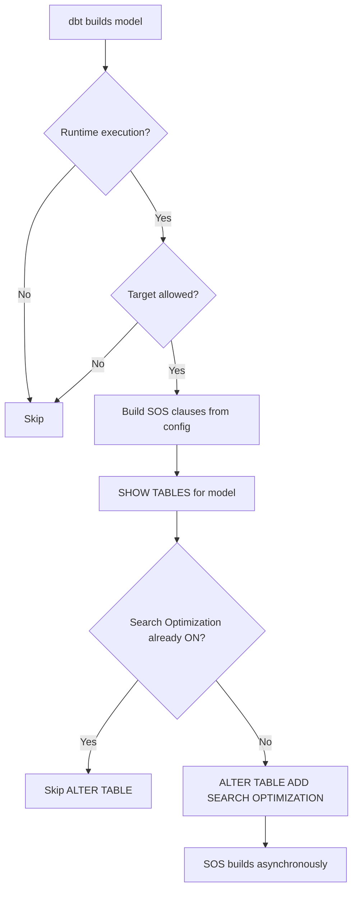

# Snowflake Search Optimization Service (SOS)

## What is SOS?

`SOS` = **Search Optimization Service**, a Snowflake-managed service designed to speed up highly selective lookup queries.

SOS builds and maintains a **persistent search access path** that helps Snowflake identify which micro-partitions contain the values being searched for.

Without SOS:

```text
filter
  ↓
micro-partition pruning
  ↓
scan remaining candidate partitions
```

With SOS:

```text
filter value
  ↓
search access path
  ↓
relevant micro-partitions
  ↓
scan only those partitions
```

In other words, instead of relying only on normal micro-partition pruning, Snowflake can use the search access path to jump directly to the small set of micro-partitions likely to contain the requested values.

---

## When SOS is useful

SOS works best for **needle-in-a-haystack queries** where the filter returns a very small portion of a large table.

### Great candidates

- High-cardinality columns
  - UUIDs
  - transaction IDs
  - payment IDs
  - customer IDs
  - email addresses
  - other near-unique identifiers
- Selective equality predicates
- `IN (...)` predicates with relatively few values
- Selective joins against large tables
- Substring / regex searches
- Full-text searches
- Certain geospatial lookups

Example:

```sql
SELECT *
FROM transactions
WHERE transaction_uuid = 'abc-123';
```

SOS is especially useful when the lookup column is **not already well served by the table's clustering / natural micro-partition organization**.

Snowflake generally recommends SOS for queries that already take at least a few seconds and where a filtered column has on the order of **100,000+ distinct values**.

### Poor candidates

SOS usually provides little benefit when:

- The column has very low cardinality.
- The query returns a large percentage of the table.
- Existing micro-partition pruning already eliminates most of the table.
- The column is already effectively handled by clustering.
- The query is already extremely fast.
- Most queries are range scans rather than point lookups.

For example:

```sql
WHERE status = 'ACTIVE'
```

If 40% of the table is `ACTIVE`, SOS cannot avoid reading much of the table anyway.

---

# Enabling SOS

## Equality search

```sql
ALTER TABLE <database>.<schema>.<table>
ADD SEARCH OPTIMIZATION
ON EQUALITY(<column>);
```

Example:

```sql
ALTER TABLE finance.prod.transactions
ADD SEARCH OPTIMIZATION
ON EQUALITY(transaction_uuid);
```

Snowflake generally recommends enabling SOS only on the columns that actually need it rather than blindly enabling it for the entire table.

---

# Search Methods

| Method | Typical predicates | Example |
|---|---|---|
| `EQUALITY` | `=`, `IN (...)` | `uuid = 'abc'` |
| `SUBSTRING` | `LIKE`, `ILIKE`, `REGEXP`, `RLIKE`, etc. | `description LIKE '%refund%'` |
| `FULL_TEXT` | `SEARCH()`, `SEARCH_IP()` | full-text search |
| `GEO` | supported `ST_*` predicates | `ST_INTERSECTS(...)` |

## EQUALITY

```sql
ALTER TABLE my_table
ADD SEARCH OPTIMIZATION
ON EQUALITY(uuid);
```

Optimizes predicates such as:

```sql
WHERE uuid = 'abc'
```

and:

```sql
WHERE uuid IN ('abc', 'def', 'ghi')
```

## SUBSTRING

```sql
ALTER TABLE my_table
ADD SEARCH OPTIMIZATION
ON SUBSTRING(description);
```

Useful for searches such as:

```sql
WHERE description LIKE '%refund%'
```

or:

```sql
WHERE description RLIKE 'refund.*failed'
```

Snowflake supports several substring predicates including `LIKE`, `ILIKE`, `CONTAINS`, `STARTSWITH`, `ENDSWITH`, `RLIKE`, and `REGEXP`. For substring search, Snowflake notes that search terms generally need to be **at least five characters** before the search access path is useful.

## FULL_TEXT

```sql
ALTER TABLE my_table
ADD SEARCH OPTIMIZATION
ON FULL_TEXT(description);
```

Used primarily with:

```sql
SEARCH(...)
```

and:

```sql
SEARCH_IP(...)
```

## GEO

```sql
ALTER TABLE my_table
ADD SEARCH OPTIMIZATION
ON GEO(location);
```

Supports selected predicates such as:

```text
ST_INTERSECTS
ST_CONTAINS
ST_WITHIN
ST_DWITHIN
ST_COVERS
ST_COVEREDBY
```

for `GEOGRAPHY` values.

---

# Checking Whether SOS Is Enabled

## Table level

```sql
SHOW TABLES LIKE '%<search-criteria>%';
```

Look at:

```text
SEARCH_OPTIMIZATION = ON
```

Also check:

```text
SEARCH_OPTIMIZATION_PROGRESS
```

This tells you how much of the table's search access path has been built.

Immediately after enabling SOS, optimization happens asynchronously, so the full performance benefit may not be available until:

```text
SEARCH_OPTIMIZATION_PROGRESS = 100
```

---

# Checking Which Columns Are Optimized

```sql
DESCRIBE SEARCH OPTIMIZATION
ON <database>.<schema>.<table>;
```

Example output:

```text
method = EQUALITY
target = transaction_uuid
active = TRUE
```

This is more useful than `SHOW TABLES` when SOS has been configured only for specific columns or search methods.

---

# Verify That a Query Actually Uses SOS

Enabling SOS does **not** guarantee that Snowflake will use it.

The query optimizer decides whether the search access path is cheaper than the normal table scan.

Run the query and inspect its **Query Profile**.

Look for:

```text
Search Optimization Access
```

If this operator appears, Snowflake actually used the SOS access path for the query.

---

# Estimate SOS Costs

Before enabling SOS:

```sql
SELECT SYSTEM$ESTIMATE_SEARCH_OPTIMIZATION_COSTS(
    '<database>.<schema>.<table>'
);
```

For a specific configuration:

```sql
SELECT SYSTEM$ESTIMATE_SEARCH_OPTIMIZATION_COSTS(
    '<database>.<schema>.<table>',
    'EQUALITY(uuid)'
);
```

The function estimates:

```text
BuildCosts
StorageCosts
MaintenanceCosts
```

SOS has three important cost components:

1. **Initial build**
   - Snowflake must create the search access path.

2. **Storage**
   - The search access path consumes additional storage.

3. **Maintenance**
   - Inserts, updates, deletes, and merges require Snowflake to maintain the access path.

Maintenance cost therefore matters particularly for tables with heavy DML activity. Snowflake notes that estimates are approximate and actual costs can differ materially from them.

---

# Checking Cardinality

SOS generally becomes more attractive as the lookup column becomes more selective.

A quick test:

```sql
SELECT
    COUNT(*) AS row_count,
    APPROX_COUNT_DISTINCT(uuid) AS distinct_values,
    COUNT(*) /
        NULLIF(APPROX_COUNT_DISTINCT(uuid), 0)
        AS avg_rows_per_value
FROM <database>.<schema>.<table>;
```

Example:

```text
row_count        = 1,000,000,000
distinct_values  =   900,000,000
avg_rows/value   =             1.1
```

That is a very strong SOS candidate for equality lookups.

Compare that with:

```text
row_count        = 1,000,000,000
distinct_values  =            10
avg_rows/value   =   100,000,000
```

That is generally a poor SOS candidate.

### Rough cardinality heuristic

These are useful **rules of thumb**, not Snowflake limits:

| Cardinality | Approx. distinct values | Typical examples |
|---|---:|---|
| Low | `< ~1K` | boolean, status, country, account type |
| Medium | `~1K–100K` | product/category dimensions |
| High | `100K+` | customer IDs, payment IDs |
| Very high | millions / near-unique | UUIDs, PKs, emails |

Snowflake specifically calls out approximately **100K+ distinct values** as a characteristic of filters that often benefit from SOS.

---

# Cardinality vs. Selectivity

**Cardinality is only a proxy. What ultimately matters is selectivity.**

Suppose:

```text
1 billion rows
100 million UUIDs
```

and:

```sql
WHERE uuid = 'abc'
```

returns:

```text
10 rows
```

Very selective → SOS can be extremely useful.

But even a high-cardinality column can be a poor candidate if the query is broad:

```sql
WHERE customer_id IN (<5 million customer IDs>)
```

because the query may still need a large fraction of the table.

A useful mental model:

```text
SOS benefit ∝ how much data the search access path lets Snowflake avoid scanning
```

A practical rule of thumb is:

```text
returned rows / total rows << 1%
```

The smaller that percentage is, the stronger the potential SOS use case. The `<1%` figure is a heuristic rather than a Snowflake-defined threshold.

---

# SOS vs. Clustering

They solve related but different problems.

### Search Optimization

Think:

> **Find a needle in a haystack.**

Best for:

```sql
WHERE transaction_uuid = ?
```

```sql
WHERE payment_id IN (...)
```

```sql
WHERE description LIKE '%specific string%'
```

### Clustering

Think:

> **Organize the haystack so related ranges sit together.**

Best for recurring filters such as:

```sql
WHERE transaction_date BETWEEN ...
```

or other broader range/equality access patterns where reorganizing micro-partitions improves pruning.

For extremely selective point lookups, SOS is generally the more appropriate mechanism. For broad range scans, clustering is typically the better fit.

---

# Quick Decision Checklist

Before enabling SOS, ask:

```text
1. Is the table large?
        ↓
2. Is the filter highly selective?
        ↓
3. Does the column have high cardinality?
        ↓
4. Is normal micro-partition pruning poor?
        ↓
5. Does the query currently take long enough to matter?
        ↓
6. Is the performance improvement worth build + storage + maintenance cost?
```

If most answers are **yes**, SOS is worth testing.

The best way to validate it is not cardinality alone:

```text
identify slow selective query
        ↓
estimate SOS cost
        ↓
enable SOS on only the relevant column(s)
        ↓
wait for SEARCH_OPTIMIZATION_PROGRESS = 100
        ↓
rerun query
        ↓
check for "Search Optimization Access"
        ↓
compare runtime + credits
```

---

# dbt Implementation

SOS can be managed through a dbt `post_hook` so that it is automatically applied after a model is built.

The macro below is designed to be **idempotent at the table level**:

- If the table was recreated (for example, during a full refresh), SOS is applied again.
- If SOS is already enabled on the table, the `ALTER TABLE` is skipped.
- Environment restrictions are optional.
- The macro supports `EQUALITY`, `SUBSTRING`, `FULL_TEXT`, and `GEO`.

> Note: the guard checks whether SOS is enabled on the table, not whether the exact configured column set matches. If the SOS configuration changes, rebuild the table or drop/reapply Search Optimization.

## dbt macro

```sql


    

        {# Optional dbt target restriction #}
        

            {{ log(
                "[SearchOpt] Skipped " ~ this ~
                " - target '" ~ target.name ~ "' not allowed",
                info=False
            ) }}

        

            
            

            {# Build ADD SEARCH OPTIMIZATION clauses #}
            
                

                
                    {{ exceptions.raise_compiler_error(
                        "Unsupported Search Optimization method: " ~ method_name
                    ) }}
                

                

                    

                        

                            {# ['column', 'ANALYZER'] #}
                            

                                

                            
                                
                            

                        

                    

                        

                    

                
            


            

                {# Check whether SOS is already enabled #}
                
                    SHOW TABLES LIKE '{{ this.identifier | replace("'", "''") }}'
                    IN SCHEMA {{ this.database }}.{{ this.schema }}
                

                
                

                
                    

                        

                            

                        

                    
                


                

                    {{ log(
                        "[SearchOpt] Skipped " ~ this ~
                        " - already enabled",
                        info=False
                    ) }}

                

                    ALTER TABLE {{ this }}
                    ADD SEARCH OPTIMIZATION ON {{ clauses | join(", ") }}

                

            

        

    


```

## How it works



The important behavior is around table recreation:

```text
normal incremental build
        ↓
table still exists
        ↓
SOS remains ON
        ↓
macro skips ALTER

full refresh / table recreation
        ↓
new table has no SOS
        ↓
macro runs ALTER TABLE
        ↓
SOS is rebuilt
```

## Using the macro in a model

```sql
{{
    config(
        materialized='incremental',
        post_hook=[
            "{{ apply_search_optimization({
                'EQUALITY': ['loan_id', 'customer_id'],
                'SUBSTRING': ['reference_number']
            }) }}"
        ]
    )
}}

SELECT ...
```

Optionally restrict the hook to specific dbt targets:

```sql
{{
    config(
        post_hook=[
            "{{ apply_search_optimization(
                {'EQUALITY': ['transaction_id']},
                allowed_targets=['prod', 'ci']
            ) }}"
        ]
    )
}}
```

Example with `FULL_TEXT` and a custom analyzer:

```sql
{{
    config(
        post_hook=[
            "{{ apply_search_optimization({
                'FULL_TEXT': [
                    ['description', 'UNICODE_ANALYZER'],
                    'notes'
                ]
            }) }}"
        ]
    )
}}
```
